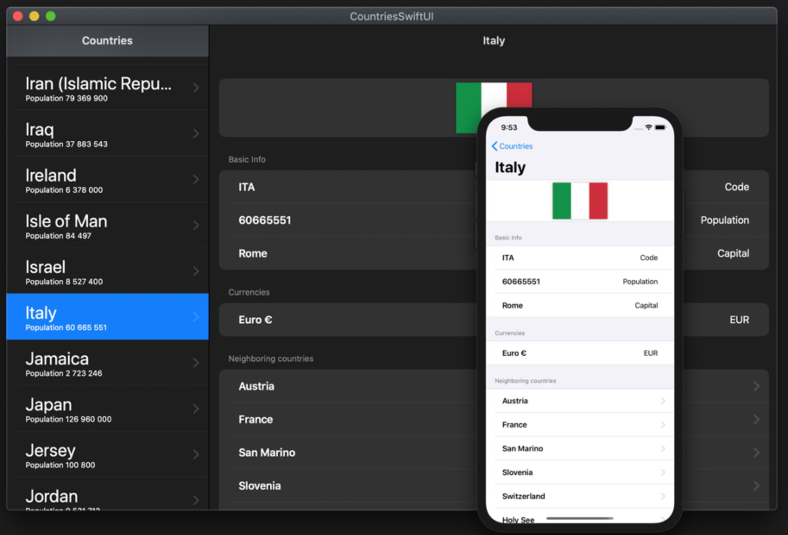

# Clean Architecture for SwiftUI + Combine

### [View all Roadmaps](https://github.com/nholuongut/all-roadmaps) &nbsp;&middot;&nbsp; [Best Practices](https://github.com/nholuongut/all-roadmaps/blob/main/public/best-practices/) &nbsp;&middot;&nbsp; [Questions](https://www.linkedin.com/in/nholuong/)

# A demo project showcasing the setup of the SwiftUI app with Clean Architecture.

The app uses the [restcountries.com](https://restcountries.com/) REST API to show the list of countries and details about them.

**Check out [mvvm branch](https://github.com/nholuongut/clean-architecture-swiftui/tree/mvvm) for the MVVM revision of the same app.**

For the example of handling the **authentication state** in the app, you can refer to my [other tiny project](https://github.com/nholuongut/clean-architecture-swiftui) that harnesses the locks and keys principle for solving this problem.

  

## Key features
* Vanilla **SwiftUI** + **Combine** implementation
* Decoupled **Presentation**, **Business Logic**, and **Data Access** layers
* Full test coverage, including the UI (thanks to the [ViewInspector](https://swiftpackageindex.com/nalexn/ViewInspector))
* **Redux**-like centralized `AppState` as the single source of truth
* Data persistence with **CoreData**
* Native SwiftUI dependency injection
* **Programmatic navigation**. Push notifications with deep link
* Simple yet flexible networking layer built on Generics
* Handling of the system events (such as `didBecomeActive`, `willResignActive`)
* Built with SOLID, DRY, KISS, YAGNI in mind
* Designed for scalability. It can be used as a reference for building large production apps

## Architecture overview

### Presentation Layer

**SwiftUI views** that contain no business logic and are a function of the state.

Side effects are triggered by the user's actions (such as a tap on a button) or view lifecycle event `onAppear` and are forwarded to the `Interactors`.

State and business logic layer (`AppState` + `Interactors`) are natively injected into the view hierarchy with `@Environment`.

### Business Logic Layer

Business Logic Layer is represented by `Interactors`. 

Interactors receive requests to perform work, such as obtaining data from an external source or making computations, but they never return data back directly.

Instead, they forward the result to the `AppState` or to a `Binding`. The latter is used when the result of work (the data) is used locally by one View and does not belong to the `AppState`.

[Previously](https://github.com/nholuongut/clean-architecture-swiftui/releases/tag/1.0), this app did not use CoreData for persistence, and all loaded data were stored in the `AppState`.

With the persistence layer in place we have a choice - either to load the DB content onto the `AppState`, or serve the data from `Interactors` on an on-demand basis through `Binding`.

The first option suits best when you don't have a lot of data, for example, when you just store the last used login email in the `UserDefaults`. Then, the corresponding string value can just be loaded onto the `AppState` at launch and updated by the `Interactor` when the user changes the input.

The second option is better when you have massive amounts of data and introduce a fully-fledged database for storing it locally.

### Data Access Layer

Data Access Layer is represented by `Repositories`.

Repositories provide asynchronous API (`Publisher` from Combine) for making [CRUD](https://en.wikipedia.org/wiki/Create,_read,_update_and_delete) operations on the backend or a local database. They don't contain business logic, neither do they mutate the `AppState`. Repositories are accessible and used only by the Interactors.

---

# I'm are always open to your feedback.  Please contact as bellow information:
### [Contact ]
* [Name: nho Luong]
* [Skype](luongutnho_skype)
* [Github](https://github.com/nholuongut/)
* [Linkedin](https://www.linkedin.com/in/nholuong/)
* [Email Address](luongutnho@hotmail.com)

# License
* Nho Luong (c). All Rights Reserved.